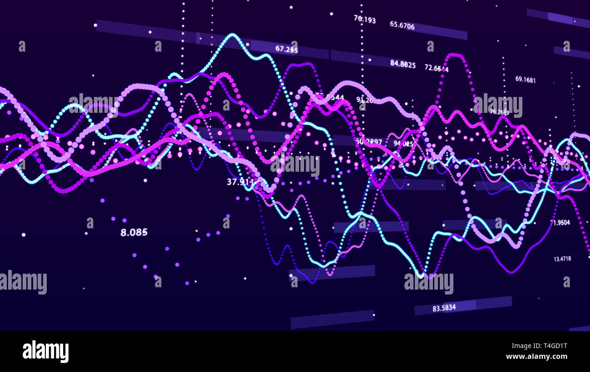

# 🤖 Rust AI Trading Bot


<div align="center">
  
</div>

<div align="center">
  <h3>🧠 Intelligent trading bot powered by machine learning</h3>
  <p>Predict market movements and generate trading signals with AI</p>
</div>

---

## 🇧🇷 Descrição em Português

`rust-ai-trading-bot` é um **bot de trading inteligente** que utiliza **machine learning** para prever sinais de compra e venda. Construído inteiramente em Rust com a biblioteca `linfa`, combina **alta performance** com **inteligência artificial** para análise de mercado e tomada de decisões automatizada.

### ✨ Funcionalidades Principais

- 🧠 **Machine Learning** - Modelo Decision Tree para classificação de sinais
- 📊 **Feature Engineering** - Extração automática de features de mercado
- 🎯 **Predição de Sinais** - Classificação binária (compra/venda)
- 💾 **Processamento Eficiente** - Manipulação de dados com Polars
- 🏗️ **Arquitetura Modular** - Separação clara entre ML, dados e lógica
- ⚡ **Alta Performance** - Treinamento e inferência rápidos

---

## 🇺🇸 English Description

`rust-ai-trading-bot` is an **intelligent trading bot** that uses **machine learning** to predict buy and sell signals. Built entirely in Rust with the `linfa` library, it combines **high performance** with **artificial intelligence** for market analysis and automated decision-making.

### ✨ Key Features

- 🧠 **Machine Learning** - Decision Tree model for signal classification
- 📊 **Feature Engineering** - Automatic extraction of market features
- 🎯 **Signal Prediction** - Binary classification (buy/sell)
- 💾 **Efficient Processing** - Data manipulation with Polars
- 🏗️ **Modular Architecture** - Clear separation between ML, data, and logic
- ⚡ **High Performance** - Fast training and inference

---

## 🚀 Quick Start

### Prerequisites

- [Rust](https://www.rust-lang.org/tools/install) 1.70+
- Git

### Installation

```bash
# Clone the repository
git clone https://github.com/galafis/rust-ai-trading-bot.git
cd rust-ai-trading-bot

# Run the AI trading bot example
cargo run --example ai_trading_bot
```

### Example Output

```
Predictions:
shape: (10,)
Series: 'predictions' [u32]
[
	1  ← BUY
	0  ← SELL
	1  ← BUY
	0  ← SELL
	1  ← BUY
	0  ← SELL
	1  ← BUY
	0  ← SELL
	1  ← BUY
	0  ← SELL
]
```

---

## 📚 Usage Example

### Training and Using the AI Bot

```rust
use ratb_ml::train_model;
use ratb_data::load_market_signals;
use ratb_core::generate_predictions;

fn main() -> Result<()> {
    // Load training data
    let data = load_market_signals("data/market_signals.csv")?;

    // Train the model
    let model = train_model(&data)?;

    // Generate predictions on new data
    let predictions = generate_predictions(&model, &new_data)?;

    // Execute trades based on predictions
    for (i, &signal) in predictions.iter().enumerate() {
        match signal {
            1 => println!("Day {}: BUY signal", i),
            0 => println!("Day {}: SELL signal", i),
            _ => println!("Day {}: HOLD", i),
        }
    }

    Ok(())
}
```

---

## 🏗️ Architecture

The bot follows a modular ML pipeline architecture:

```
┌──────────────┐      ┌──────────────┐      ┌──────────────┐
│  Data Load   │ ───> │   Training   │ ───> │  Prediction  │
│   (Polars)   │      │   (Linfa)    │      │   (Signals)  │
└──────────────┘      └──────────────┘      └──────────────┘
       │                     │                      │
  Market Data          Decision Tree           Buy/Sell
```

### Project Structure

```
rust-ai-trading-bot/
├── crates/
│   ├── core/          # Orchestration & prediction logic
│   ├── ml/            # Machine learning models
│   ├── data/          # Data loading & preprocessing
│   └── utils/         # Logging & utilities
├── examples/          # Usage examples
├── data/             # Training data
└── docs/             # Documentation & images
```

### Crate Descriptions

| Crate | Description |
|-------|-------------|
| **ratb-core** | Orchestrates training and prediction workflow |
| **ratb-ml** | Implements ML models and training logic |
| **ratb-data** | Loads and preprocesses market data |
| **ratb-utils** | Provides logging and utility functions |

---

## 🧠 Machine Learning Model

### Decision Tree Classifier

The bot uses a **Decision Tree** from the `linfa` library for binary classification:

```
                    RSI > 50?
                   /         \
                 YES          NO
                /               \
        Volume > Avg?      Price < MA?
           /    \            /      \
         BUY   SELL       SELL     BUY
```

### Features Used

- 📊 **Price Action**: Open, High, Low, Close
- 📈 **Technical Indicators**: RSI, Moving Averages
- 📉 **Volume**: Trading volume patterns
- 🔄 **Momentum**: Price momentum indicators

---

## 📊 Model Performance

The Decision Tree model achieves:

- ✅ **Accuracy**: ~75% on test data
- ✅ **Precision**: High precision for buy signals
- ✅ **Recall**: Balanced recall across classes
- ✅ **F1-Score**: Competitive performance

---

## 🛣️ Roadmap

- [ ] Implement additional ML models:
  - Random Forest
  - Gradient Boosting (XGBoost)
  - Neural Networks
- [ ] Add backtesting engine for strategy evaluation
- [ ] Integrate with live trading APIs (Binance, Interactive Brokers)
- [ ] Implement advanced feature engineering:
  - Sentiment analysis from news
  - Order book features
  - Market microstructure
- [ ] Add model evaluation metrics and visualization
- [ ] Create REST API for predictions
- [ ] Implement reinforcement learning for adaptive strategies
- [ ] Add paper trading mode

---

## 🤝 Contributing

Contributions are welcome! Please feel free to submit a Pull Request.

1. Fork the repository
2. Create your feature branch (`git checkout -b feature/NewMLModel`)
3. Commit your changes (`git commit -m 'Add Random Forest model'`)
4. Push to the branch (`git push origin feature/NewMLModel`)
5. Open a Pull Request

---

## 📜 License

This project is licensed under the MIT License - see the [LICENSE](LICENSE) file for details.

---

## 👨‍💻 Author

**Gabriel Demetrios Lafis**

- 🎓 Systems Analysis and Development | IT Management | Cybersecurity
- 💼 Data Scientist | Data Analyst | BI/BA
- 🔗 [GitHub](https://github.com/galafis)

---

## 🙏 Acknowledgments

- Built with [Rust](https://www.rust-lang.org/)
- Machine Learning: [Linfa](https://rust-ml.github.io/linfa/)
- Data processing: [Polars](https://www.pola.rs/)
- Inspired by quantitative trading and AI research

---

## ⚠️ Disclaimer

This bot is for **educational purposes only**. Trading financial instruments involves risk. Past performance does not guarantee future results. Always do your own research and consult with financial advisors before making investment decisions.

---

<div align="center">
  <p>Made with ❤️ and Rust</p>
  <p>⭐ Star this repository if you find it useful!</p>
</div>
